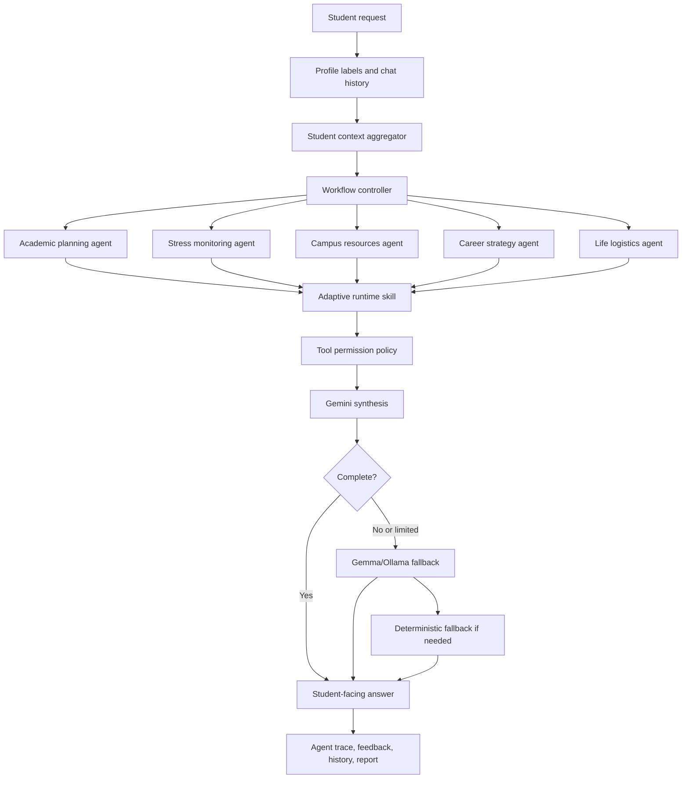

# ORBIT


## Personalized Multi-Agent AI for Student Life, Academic Planning, and Wellbeing

ORBIT is a student-centered AI workspace that helps college students plan their
schoolwork, manage stress, navigate campus resources, choose courses, coordinate
life logistics, and act on real student data. It is built as a labelized,
customized, multi-role agentic AI system rather than a general chatbot.

The core idea is simple: students do not need one more generic chatbot. They
need an assistant that knows their context, remembers constraints they choose to
share, understands campus-specific systems, and coordinates multiple specialist
agents before giving advice.

ORBIT is designed around a product belief: student support should be personal,
explainable, action-oriented, and connected to the real systems students use
every day.

---

## Product Narrative

ORBIT can be understood as a **student success operating layer**. It starts with
the student's situation, turns that context into **labels**, activates the right
**agent roles**, checks the right **tools or data sources**, and returns a plan
the student can actually use.

| Moment | Product focus | What it demonstrates |
| --- | --- | --- |
| Student problem | **Disconnected tools** and **cognitive overload** | Students are overloaded by coordination work, not just by missing information. |
| Product vision | **Personalized student AI workspace** | ORBIT is built for student life, not generic conversation. |
| Setup | **Adaptive questions** and **labels** | A student profile becomes routing logic for future help. |
| Chat | **Multi-role agent collaboration** | One message can activate academic, stress, campus, career, and logistics agents. |
| Report | **Student-facing wellbeing and workload intelligence** | ORBIT turns history into warm, actionable guidance. |
| Campus intelligence | **UMD-specific data and resources** | Course planning, food, maps, housing, rent, tutoring, disability support, and career resources can be routed from one place. |
| Architecture | **Explainable agent system** | Every answer can expose agents, tools, model path, and fallback reason. |

---

## Opening Story

Imagine Maya, a UMD student. She has a CMSC216 project near IRB, a STAT400 quiz
coming up, a work shift later, and she still needs vegan food. A general chatbot
can give generic advice like "make a plan" or "find a restaurant." But Maya
does not only need text. She needs a coordinated decision:

- What should I do in the next 90 minutes?
- Where can I eat that fits my vegan preference and campus route?
- Which academic task should I protect first?
- Is my calendar already conflicting with the plan?
- Should this become a calendar block or an email?
- Am I stressed enough that the plan should become smaller?

That is the difference ORBIT is designed for. ORBIT does not start from a blank
conversation every time. It starts from the student's labels, history, campus
context, workload signals, and current request.

---

## The Problem

College students live inside a **fragmented digital ecosystem**:

- **Canvas / ELMS** has assignments and deadlines.
- **Google Calendar** has classes, work, events, and study blocks.
- Google Maps and campus routes determine what is realistic between locations.
- Course/professor information lives in **PlanetTerp**, **Testudo**,
  **umd.io**, and review/forum sources.
- Accessibility, counseling, tutoring, financial aid, food security, housing,
  transport, and career support all live in separate offices and websites.
- Students may also be first-generation, international, disabled, working,
  financially stressed, commuting, learning English, managing ADHD, or trying to
  understand that they may need accommodations.

The real problem is not that information does not exist. The problem is that
students must **integrate all of it while already under stress**.

ORBIT's thesis: student support AI should act like a **coordinated advisor
system**, not a single prompt-response bot.

---

## Why ORBIT Matters

ORBIT is built around students who are often underserved by generic productivity
tools:

- Incoming students who do not know campus buildings, offices, or expectations.
- First-generation students who may not know hidden academic processes.
- International students who may face language, visa, culture, and campus system
  barriers.
- Students with disabilities or students realizing they may need support.
- Students managing ADHD, depression, anxiety, burnout, or executive-function
  challenges.
- Students with financial pressure, rent stress, food insecurity, or work shifts.
- Students choosing classes without knowing difficulty, professor style, or
  workload.
- Students trying to balance exams, jobs, internships, commuting, clubs, and
  everyday life.

ORBIT turns these needs into local profile labels and uses those labels to route
the right agents, tools, recommendations, and resources.

---

## How ORBIT Differs From ChatGPT or Claude

General chatbots are powerful, but they usually begin from the current prompt.
ORBIT begins from a student model.

| General chatbot | ORBIT |
| --- | --- |
| Responds mainly to the **current text**. | Uses current text plus **labels, history, monitor state, and campus context**. |
| May give **broad advice**. | Builds a **concrete next action** based on deadlines, stress, route, food, schedule, and student constraints. |
| Does not know what tools are safe to use. | Uses **tool permissions** and **connected action cards**. |
| Does not automatically remember student-specific needs unless told repeatedly. | Stores durable local labels such as `vegan`, `working_student`, `first_generation_student`, `stress_sensitive`, `course_selection`, and `campus_navigation`. |
| One model role answers everything. | Multiple specialized roles collaborate: **academic planning**, **stress monitoring**, **campus resources**, **career strategy**, **life logistics**, and **response synthesis**. |
| Usually does not show why it answered a certain way. | Shows an **agent trace** so the user can see which agents and model path were used. |
| Usually ignores campus-specific data unless pasted manually. | Can fetch or mimic **Canvas**, **Calendar**, **Maps**, **Places**, **PlanetTerp**, **Testudo/umd.io**, **UMD resources**, housing, rent, dining, and life logistics signals. |

The result is a more customized student experience: less generic, more grounded,
and more action-oriented.

---

## What Happens Behind One ORBIT Answer

When Maya asks what to do in the next 90 minutes, ORBIT does not treat the
message as an isolated prompt. The system builds a short-lived decision context:

1. It reads durable labels such as `vegan`, `campus_navigation`,
   `stress_sensitive`, `canvas`, `google_calendar`, and `work_shift_constraints`.
2. It checks recent chat history for constraints Maya has already shared.
3. It evaluates academic pressure from assignments, quizzes, and course context.
4. It checks schedule pressure and possible conflicts.
5. It activates role agents that match the situation.
6. It creates or selects a runtime skill for the current task.
7. It determines whether connected actions are appropriate, such as a map route,
   calendar block, or email draft.
8. It synthesizes the final answer with Gemini when available, falls back to
   Gemma/Ollama when Gemini is limited or incomplete, and still has deterministic
   agent logic if both model paths are unavailable.
9. It records an agent trace and feedback signal so the answer is inspectable.

This is the product moat: ORBIT turns **student context into action**, not just
conversation.

---

## Why Labelization Is Central


Labels are ORBIT's bridge between raw student context and personalized
assistance. They let the system stay lightweight while still behaving as if it
understands the student.

A label can represent a preference, identity context, support need, academic
pattern, or tool source:

- Preference: `vegan`, `plant_based`, `gluten_free`
- Academic pattern: `exam_prep`, `course_selection`, `regular_review`
- Life context: `working_student`, `commuter`, `renting`, `financial_stress`
- Support context: `first_generation_student`, `international_student`,
  `language_support`, `accessibility`, `adhd_support`
- Tool context: `canvas`, `google_calendar`, `campus_navigation`,
  `professor_ratings`

The same label can affect multiple parts of the system. For example,
`stress_sensitive` can make plans shorter, activate the stress monitoring agent,
change report recommendations, and prioritize resource-aware language.
`campus_navigation` can make ORBIT consider walking routes and Google Maps
actions. `course_selection` can route the question toward professor and workload
signals.

The diagram above shows the core workflow: **adaptive setup questions** become
**profile labels**, labels become **runtime skills**, skills activate the right
**agent roles**, connected tools supply real context, and ORBIT returns a
**personalized student answer**.

---

## Demo Persona: Maya Chen

ORBIT includes a seeded student profile so the full experience can be explored
without connecting a real student account:

- Name: Maya Chen
- School email: `maya.chen@umd.edu`
- Student context: UMD student, vegan/plant-based, near IRB and McKeldin,
  CMSC216 project pressure, STAT400 quiz, work shifts, stress-sensitive planning
- Demo data: month-long monitor history, chat history, generated skill, audit
  trace, campus resources, course planning, and connected action examples

Maya's profile shows what ORBIT looks like after it has enough context to be
useful. The app can open directly into a personalized workspace with stored
labels, prior chats, report data, and demo connectors already prepared.

---

## Student Journeys ORBIT Supports

ORBIT is designed for the messy, blended reality of student life. A single
student may need academic help, emotional pacing, campus navigation, career
planning, and life logistics in the same afternoon. The product treats those as
connected needs instead of separate apps.

### Academic Support

ORBIT can help students break down assignments, prepare for exams, review course
material, identify the most fragile class, draft TA questions, and build
short-term rescue plans. For UMD, course planning can incorporate CMSC/STAT-style
workload, PlanetTerp-like professor/course signals, and Testudo/umd.io-style
registration truth.

### Wellbeing and Stress Management

ORBIT does not diagnose. It watches for workload pressure, calendar density,
stress-sensitive labels, and recovery gaps. When stress is high, ORBIT changes
the plan: fewer tasks, smaller checkpoints, clearer stopping points, and warmer
language. When needed, campus resource routing can surface counseling,
accessibility, tutoring, or crisis-support paths.

### Accessibility and Disability Support

Students may already have accommodations, or they may be realizing they need
help for the first time. ORBIT can preserve labels such as `accessibility`,
`accommodation`, `adhd_support`, and `accommodation_exploration` so future
answers can suggest the right pace, the right wording for asking for help, and
the right UMD resource path without forcing the student to explain everything
again.

### International, First-Generation, and Financially Stressed Students

ORBIT can use labels such as `international_student`, `language_support`,
`first_generation_student`, and `financial_stress` to make guidance more
explicit. That can mean explaining campus terminology, helping draft clearer
emails, routing to ISSS or financial aid resources, or recognizing that a study
plan must fit around work, rent, food, transport, and family pressure.

### Everyday Life Logistics

Student success is not only coursework. ORBIT can help with vegan food, campus
routes, Google Maps actions, rent and housing resources, shopping, commuting,
events, clubs, CS email lists, job search, internships, and calendar planning.
This is where ORBIT becomes more than a tutor: it becomes a daily coordination
layer.

---

## Product Walkthrough With Screenshots

### 1. Signup and Login

ORBIT starts with a normal student account flow. New users can sign up and answer
setup questions, while returning users can log in. Maya's seeded profile opens
the app with labels, history, monitor data, and demo connectors already prepared.


The account flow supports both first-time students and returning students. A new
student can build a profile from setup questions. A returning student can resume
with prior labels, chat history, report data, and connected action preferences.
This matters because student support improves when the system does not reset to
zero every session.

### 2. Adaptive Setup and Label Creation

The setup page asks focused background questions to build initial labels. It does
not ask every possible question to every student. Questions adapt based on prior
answers, so international students see language follow-ups, students with
accessibility context see accommodation questions, and career follow-ups appear
when career support is relevant.

The setup covers:

- Food preferences such as vegan, vegetarian, allergy-aware, halal, kosher, or
  gluten-free.
- Age/life-stage context.
- Undergraduate, master's, PhD, returning, incoming, or nontraditional student.
- Major/path such as CS, engineering, math, physics, biology, health science,
  business, policy, humanities, arts, or undecided.
- Full-time, part-time, working student, commuter, caregiver, or family duties.
- First-generation college student context.
- Financial stress, food cost, rent, housing, transport, or shopping pressure.
- Disability, ADHD, depression, anxiety, accommodation, and access needs.
- International student and first-language context.
- Academic strengths and stressful subjects.
- Course support, exam preparation, regular review, class choice, professor fit,
  internships, events, email lists, and life logistics.


This is where ORBIT becomes personalized. Instead of waiting for a student to
repeat the same life context in every prompt, the setup flow creates a starting
label profile. Those labels become routing signals for agents, tools,
recommendations, and safety-aware resource suggestions.

For example, a student who selects vegan food, work shifts, stress around exams,
and campus navigation does not simply receive four static tags. ORBIT can use
those labels together: suggest food that fits the route, keep study plans shorter
before work, make exam preparation less overwhelming, and surface campus
resources only when relevant.

### 3. Chat Workspace

The chat screen is the student's main workspace. The top bar shows the current
student and the active model path, such as Gemini or Gemma. Header icons open the
guide, chat history, report, demo path, course planner, intelligence dashboard,
and settings.


The interface is intentionally familiar, but the behavior underneath is more
structured than a standard chatbot. Each message can pass through ORBIT's label
router, multi-agent orchestrator, student context aggregator, connected action
detector, and model fallback path. The student sees a clean answer, while the
system keeps the reasoning path inspectable through the agent trace.

---

## Live Demo Video 1: Ask for Food Place

Video: [Orbit - Ask for Food Place](https://youtu.be/daW_iRL8FWU)

[](https://youtu.be/daW_iRL8FWU)

In this demo, Maya asks:

> I have CMSC216 near IRB, a work shift later, and I still need vegan food. What
> should I do in the next 90 minutes without making my stress worse?

ORBIT responds with a **coordinated plan**:

- Recognizes **Maya's stress** and does not overload her.
- Uses **vegan/plant-based preference**.
- Considers her **location near IRB**.
- Suggests Maryland Hillel Cafe or NuVegan Cafe as campus-relevant food options.
- Connects the food decision to **academic triage**.
- Creates a simple task table for CMSC216 and STAT400.
- Offers **connected actions** such as adding a calendar block or opening a
  walking route.
- Shows an **agent trace** with roles such as workflow controller, academic
  planning, stress monitoring, campus resources, career strategy, and response
  synthesizer.


The video frame opens the YouTube demo. The app screenshots below capture the
same flow: **real-time chat**, **connected action card**, **Google Maps route
launch**, **model badge**, and **agent trace**.

A generic chatbot might say "eat first, then study." ORBIT ties the food
recommendation to Maya's diet, campus route, deadline pressure, stress level,
calendar context, and next 90 minutes. The answer is not just comforting; it
becomes operational.

---

## Live Demo Video 2: Sent Email and Calendar Invite

Video: [Orbit - Sent Email](https://youtu.be/w1HK6_Pdn8Y)

[](https://youtu.be/w1HK6_Pdn8Y)

In this demo, Maya asks ORBIT to write an email to Alex and send a calendar
invite for a vegan meal at Maryland Hillel Cafe.

ORBIT:

- Drafts a natural **email in Maya's voice**.
- Includes the recipient, date, time, and place.
- Notices a **calendar conflict** with a project study group.
- Asks Maya to confirm whether the time should change.
- Provides **connected actions** to add a Google Calendar block and send an
  email update.
- Uses demo notifications to mimic successful calendar/email actions without
  requiring a real email account.


The video frame opens the YouTube demo. The screenshot below captures the same
flow: **real-time email drafting**, **calendar conflict checking**, **connected
action buttons**, and a demo notification confirming the email/calendar action.

The key product behavior is coordination. ORBIT does not only draft words; it
checks whether the plan conflicts with the student's calendar, prepares the
communication, and exposes the next action. In demo mode, calendar and email
actions are safely mimicked. In production, these actions would go through OAuth,
permission checks, and explicit user confirmation.

---

## Student Report: Turning Data Into Care

The report page is what the student sees instead of an internal developer
dashboard. It summarizes the student's current state across time windows:

- Now
- 3 days
- Week
- Month
- 6 months
- Full year
- Year to date
- All time

The report includes:

- Happiness
- Stress ease
- Focus room
- Recovery room
- Momentum
- Support fit
- Deadline pressure
- Calendar density
- Warm advisor-style recommendations
- Next best moves
- Trend charts and month-long checkpoint history


This is not just analytics. The report is phrased like a caring advisor. It
tells the student what the system is seeing and what to do next without making
them feel judged. The scores are designed to create reflection and action, not
shame. A high stress window becomes a smaller plan, a recovery recommendation,
and a route toward support.

---

## Chat History and Continuity

ORBIT stores prior conversations locally so future answers can use the student's
real context. Maya's seeded history includes longer multi-turn-like examples with
agent traces:

- Vegan preference near IRB and McKeldin.
- CMSC216 anxiety and first-step planning.
- Work-shift constraints.
- Emailing a TA without sounding panicked.
- Career fair prep without sacrificing deadlines.
- Food route and Google Maps action.
- Calendar and email demo actions.


The goal is continuity. The student should not have to re-explain their diet,
commute, work shifts, anxiety patterns, language needs, campus confusion, or
course pressure every time. History helps ORBIT answer like an advisor who
remembers the student's real situation.

---

## UMD Demo Path: A Full Student Support Scenario

The UMD Demo Path is the strongest investor demo because it shows the entire
system working around one concrete student.

It includes:

- Maya's profile labels.
- Canvas-style deadline pressure.
- Google Calendar-style schedule pressure.
- Vegan and campus route constraints.
- Stress alerts.
- Next best action plan.
- Notification policy.
- UMD resource cards.
- Agent execution path.
- Data and privacy controls.


This page shows how ORBIT combines academic risk, stress, food, route, calendar,
and campus resources. It is not just answering a question. It is coordinating
support across the realities of student life.

The demo path also makes the product vision concrete: the same student profile
can produce a food recommendation, a deadline rescue plan, a break notification,
a UMD resource match, and an agent execution path. Each surface is connected to
the same underlying labels and student state.

---

## Course Planner: UMD-Specific Academic Decisions

ORBIT includes a course planner that helps students think about:

- Which classes fit their goals.
- Whether the semester is too heavy.
- Which courses are easy, moderate, or hard.
- Which professors may be a better fit.
- How stress level, commuting, career goals, and workload should affect class
  choice.
- How PlanetTerp-style course/professor signals and Testudo/umd.io-style
  official data can support decisions.


Course planning is a high-value student decision. ORBIT can combine professor
ratings, historical grade data, prerequisites, course difficulty, stress level,
career direction, commuting constraints, and current workload to recommend a
semester that is ambitious but realistic.

This is especially important for students who do not already know which classes
are considered difficult, which professor styles fit them, or how to balance a
technical course with work and life responsibilities. ORBIT can become a guided
decision layer over course catalogs and review sites.

---

## Intelligence Dashboard: How the Agent System Explains Itself

The intelligence dashboard shows that ORBIT is not a black box:

- Demo readiness.
- Investor tour checklist.
- Label-driven agent collaboration.
- Skill registry.
- Saved runtime skills.
- Feedback signal.
- Agent audit trail.
- Evaluation readiness.


This dashboard makes the agentic system inspectable. It shows which skills were
generated, which agents activated, which tools were considered, which feedback
signals were captured, and how readiness is evaluated. For a student support
product, this transparency matters: advice should be useful, but it should also
be auditable.

---

## Core Features

### 1. Labelized Student Profile

ORBIT creates labels from setup, chat history, imported signals, and demo/live
data. Examples:

- `vegan`
- `plant_based`
- `working_student`
- `part_time_student`
- `first_generation_student`
- `international_student`
- `language_support`
- `financial_stress`
- `accessibility`
- `mental_health_support`
- `adhd_support`
- `stress_sensitive`
- `campus_navigation`
- `course_selection`
- `professor_ratings`
- `career_builder`
- `event_recommendations`
- `renting`
- `shopping_support`
- `life_logistics`

These labels are not only tags. They are routing signals.

### 2. Customized Multi-Role Agentic AI

ORBIT uses role agents that collaborate before producing a final response:

- Workflow controller: chooses routing, tools, and skill order.
- Academic planning: assignments, exams, study plans, course selection.
- Stress monitoring: workload, pacing, recovery, and small next steps.
- Campus resources: UMD offices, tutoring, accessibility, counseling, housing,
  food, legal aid, financial aid, and resource navigation.
- Career strategy: resumes, internships, interview prep, career fair planning.
- Life logistics: food, walking routes, shopping, renting, commuting, and daily
  planning.
- Response synthesizer: turns agent outputs into a warm, student-facing answer.

### 3. Agent Role and Skill Generation

For each request, ORBIT can generate an adaptive runtime skill. The skill uses:

- Current query.
- Selected label.
- Profile labels.
- Recent labels.
- Chat history.
- Imported external labels.
- Stress band.
- Recommended tool permissions.

Example:

```text
Current query:
Maya needs vegan food, has CMSC216 pressure, is near IRB, and has work later.

Generated skill:
Planning + wellbeing support router

Activated tools:
chat_history_lookup -> canvas_course_scan -> calendar_signal_review
-> stress_report_summarizer -> live_places_search -> campus_route_planner
```

This is how ORBIT creates a customized experience for a student instead of a
generic answer.

### 4. Connected Actions

ORBIT can show action cards inside chat:

- Open walking route in Google Maps.
- Add a Google Calendar block.
- Send or mimic an email update/invite.

Calendar and email can be mimicked with notifications in demo mode, so the
experience is safe to show without sending real messages or creating real
calendar events. On Android, map actions can open the Google Maps app. On web,
routes open in the browser.

### 5. Real and Demo Data Strategy

ORBIT is designed to work in two modes:

Demo mode:

- **Deterministic Maya Chen UMD scenario.**
- **Seeded labels, chat history, report data, resources, and actions.**
- No real credentials required.

Live mode:

- **Canvas/ELMS assignments and courses.**
- **Google Calendar events.**
- **Google Maps/Routes.**
- **Google Places.**
- **PlanetTerp course/professor signals.**
- **Testudo/umd.io official course structure.**
- **UMD resource catalog.**
- **Housing, rent, food, transport, and life logistics search.**
- **Forum and community retrieval when needed**, such as Reddit-style student
  discussion signals for lived experience around courses, housing, commute, or
  campus life. These signals should be treated as context, not official truth.

### 6. Model Fallback

ORBIT uses a practical model path:

1. Try Gemini when a local API key is configured.
2. If Gemini is rate-limited, incomplete, empty, or fails, finish the same
   multi-agent chain with local Gemma/Ollama.
3. If both model paths fail, use deterministic agent logic so the demo still
   produces a useful response.

The trace tells the truth about which path was used.

---

## System Architecture


ORBIT's architecture is built around a clear progression: **student context** is
converted into **labels**, labels activate a **multi-role agent layer**, agent
outputs pass through a **skill and tool router**, model synthesis uses fallback
paths when needed, and the result becomes **student action surfaces** such as
chat answers, reports, maps, calendar blocks, email drafts, and resource
recommendations.



### Important Implementation Layers

| Layer | Purpose |
| --- | --- |
| Onboarding label ranker | Creates initial student support labels from adaptive setup answers. |
| Prompt router | Uses selected and inferred labels to recommend prompt chips and skills. |
| Support intelligence service | Builds stress reports, follow-up questions, suggestions, and skill blueprints. |
| ORBIT agent orchestrator | Activates role agents and coordinates final response synthesis. |
| Student context aggregator | Loads live or demo Canvas, Calendar, Places, Routes, and course data. |
| UMD resource catalog | Routes students to official UMD resources for tutoring, accessibility, counseling, financial aid, housing, transport, safety, and more. |
| Course planning service | Combines course workload, professor/course signals, stress level, and profile labels. |
| Agent audit log | Records activated roles, skills, tools, sources, model path, latency, and fallback reason. |
| Student report | Converts monitor history into student-facing charts, ratings, and recommendations. |

---

## Data Sources and UMD-Specific Support


ORBIT's UMD support strategy includes:

- **Canvas / ELMS**: active courses, assignment names, due dates.
- **Google Calendar**: upcoming events, schedule density, conflicts.
- **Google Maps / Routes**: walking routes and commute constraints.
- **Google Places**: food, study spots, housing/rent, shopping, campus life
  search.
- **PlanetTerp**: course metadata, professor reviews, historical grade signals.
- **Testudo / umd.io**: official course, prerequisite, section, and registration
  structure.
- **Student forums and Reddit-style community signals**: optional real-time
  context for lived student experience around professors, housing, commuting,
  food, and campus life. ORBIT should clearly distinguish these from official
  university sources.
- **UMD resource catalog**: Accessibility and Disability Service, Counseling
  Center, TLTC, Career Center, Health Center, Dining, Campus Pantry, ResLife,
  DOTS, ISSS, Writing Center, tutoring, Guided Study Sessions, Math Success,
  Keystone, OMSE, Student Legal Aid, Crisis Fund, Financial Aid, Dean of
  Students, OCRSM, NITE Ride, Paratransit, Terp Ride, Guardian App, Help Center,
  and related support paths.

This **campus-specific layer** is a major differentiator. ORBIT can answer
"what should I do?" with the right **office**, **route**, **course signal**,
**calendar action**, and **next step**.

The real data pipeline separates **official institutional sources** from
**community/forum context**. Official sources such as Canvas, Testudo/umd.io,
and UMD offices are treated as truth. Community signals, including Reddit-style
discussion, are useful for lived experience but should remain contextual and
clearly labeled.

---

## Privacy and Safety Approach

ORBIT is designed as a local-first demo and prototype:

- Profile labels are stored locally.
- Demo mode does not require real accounts.
- Live data is opt-in.
- `.env` stays local and must not be committed.
- Calendar/email actions are mimicked in demo mode unless real OAuth is added.
- Irreversible actions should be blocked or require explicit approval.
- Mental health content is support and resource routing, not diagnosis or
  therapy.
- Sensitive contexts such as disability, ADHD, depression, financial stress, and
  first-generation status should be used only to make help more respectful and
  practical.

---

## What ORBIT Proves

ORBIT demonstrates that student AI can move beyond a generic assistant model.
The product brings together four capabilities that are usually separated:

1. Personalized memory through local labels and chat history.
2. Multi-agent reasoning across academic, wellbeing, campus, career, and life
   domains.
3. Campus-specific data integration across UMD resources, courses, maps,
   calendars, and student support systems.
4. Action surfaces that turn advice into next steps, such as route launch,
   calendar blocks, email drafts, report recommendations, and course plans.

The larger opportunity is to make ORBIT the personalized AI layer for student
success. Instead of students manually coordinating Canvas, Calendar, Maps,
PlanetTerp, Testudo, tutoring, disability services, counseling, financial aid,
housing, food, internships, and daily tasks, ORBIT can become the explainable
workspace that coordinates those systems around the individual student.

---

## Final Takeaway

ORBIT is not only a UI demo. It is a product direction for a real
student-success platform: personalized, campus-aware, explainable, and
action-oriented.

| Takeaway | Why it matters |
| --- | --- |
| **Personalization depth** | ORBIT uses durable labels, history, report state, and imported context instead of treating every prompt as a new conversation. |
| **Agentic architecture** | The answer is produced through **multi-role collaboration**, not a single undifferentiated model response. |
| **Real data readiness** | The system is structured around **Canvas/ELMS**, **Google Calendar**, **Google Maps/Places**, **PlanetTerp**, **Testudo/umd.io**, UMD resources, and optional community/forum retrieval. |
| **Student-facing empathy** | The report and recommendations are designed to feel like a caring advisor, especially during stress, accessibility, financial, or first-generation support scenarios. |
| **Actionability** | ORBIT can move from advice to action through **calendar blocks**, **email drafts**, **map routes**, **course plans**, and **resource routing**. |
| **Explainability** | Agent traces, audit logs, feedback signals, and model fallback reasons make the system inspectable. |
| **Demo reliability** | The Maya Chen fixture gives a repeatable product walkthrough even when real credentials, OAuth, or network APIs are unavailable. |
| **Production path** | The architecture already separates local demo data, live connectors, model synthesis, tool permissions, and privacy-sensitive student labels. |

The strongest product signal is that ORBIT can answer a student question with a
plan that is **personal**, **campus-aware**, **resource-aware**, and
**immediately actionable**. That is the difference between a chatbot that
responds and an advisor system that helps a student move forward.

---

# Technical Setup and Usage

The sections below are for developers running or modifying the app.

## Prerequisites

- Flutter SDK 3.4.1 or later.
- Dart, included with Flutter.
- Node.js, only for the optional Student Data Proxy.
- Ollama, optional for local Gemma synthesis.
- Android Studio or a physical Android device for mobile testing.

## Local Environment

Open PowerShell in the project root:

```powershell
cd C:\Users\zianz\OneDrive\Documents\GitHub\orbit
```

Install dependencies:

```powershell
& 'C:\Users\zianz\flutter\bin\flutter.bat' pub get
```

If `.env` does not exist:

```powershell
if (-not (Test-Path .env)) { Copy-Item .env.example .env }
```

Recommended local `.env` template:

```env
API_KEY=
LOCAL_LLM_ENDPOINT=http://127.0.0.1:11434
LOCAL_LLM_MODEL=gemma3:4b
EXTERNAL_DATA_ENABLED=false
STUDENT_DATA_PROXY_URL=
STUDENT_DATA_PROXY_USER_ID=demo
EXTERNAL_DATA_CACHE_SECONDS=300
EXTERNAL_DATA_TIMEOUT_SECONDS=8
CANVAS_BASE_URL=https://umd.instructure.com
CANVAS_ACCESS_TOKEN=
GOOGLE_ACCESS_TOKEN=
GOOGLE_MAPS_API_KEY=
CAMPUS_ROUTE_ORIGIN=McKeldin Library, College Park, MD
CAMPUS_ROUTE_DESTINATION=University Health Center, College Park, MD
```

Important: keep real Gemini, Canvas, and Google keys only in local `.env`.
Do not commit `.env`.

## Run the App

### Web

```powershell
& 'C:\Users\zianz\flutter\bin\flutter.bat' run -d chrome
```

Build web:

```powershell
& 'C:\Users\zianz\flutter\bin\flutter.bat' build web
```

### Android

Start an emulator or connect an Android device, then:

```powershell
& 'C:\Users\zianz\flutter\bin\flutter.bat' devices
& 'C:\Users\zianz\flutter\bin\flutter.bat' run -d android
```

Build APK:

```powershell
& 'C:\Users\zianz\flutter\bin\flutter.bat' build apk
```

APK output:

```text
build\app\outputs\flutter-apk\app-release.apk
```

### Windows Desktop

```powershell
& 'C:\Users\zianz\flutter\bin\flutter.bat' config --enable-windows-desktop
& 'C:\Users\zianz\flutter\bin\flutter.bat' run -d windows
```

## Demo Login

Use the seeded demo account:

```text
Email: maya.chen@umd.edu
Password: 12345
```

Or click:

```text
Use Maya demo profile
```

Before a presentation, use "Reset Maya demo" from the demo/intelligence surfaces
to reseed Maya's profile, chat history, report history, saved skill, feedback,
and audit trace.

## Optional Local Gemma / Ollama

Install Ollama, then:

```powershell
ollama pull gemma3:4b
ollama serve
```

Keep `.env` configured as:

```env
LOCAL_LLM_ENDPOINT=http://127.0.0.1:11434
LOCAL_LLM_MODEL=gemma3:4b
```

ORBIT tries Gemini first when `API_KEY` is configured, falls back to local
Gemma/Ollama, then falls back to deterministic agent logic.

## Optional Live Data Proxy

Start the proxy:

```powershell
cd C:\Users\zianz\OneDrive\Documents\GitHub\orbit\backend\student-data-proxy
node server.mjs
```

Default proxy URL:

```text
http://127.0.0.1:8787
```

Configure Flutter `.env`:

```env
EXTERNAL_DATA_ENABLED=true
STUDENT_DATA_PROXY_URL=http://127.0.0.1:8787
STUDENT_DATA_PROXY_USER_ID=demo
```

Useful endpoints:

```text
GET  http://127.0.0.1:8787/health
GET  http://127.0.0.1:8787/auth/google/start?userId=demo
POST http://127.0.0.1:8787/connect/canvas
GET  http://127.0.0.1:8787/student/snapshot?userId=demo&taskText=food&preferenceTags=vegan
GET  http://127.0.0.1:8787/course-planning/umd?courses=CMSC216,STAT400&profileTags=stress_sensitive,commuter
```

Example Canvas connect:

```powershell
Invoke-RestMethod `
  -Uri http://127.0.0.1:8787/connect/canvas `
  -Method Post `
  -ContentType 'application/json' `
  -Body '{"userId":"demo","baseUrl":"https://umd.instructure.com","accessToken":"YOUR_CANVAS_TOKEN"}'
```

## Analyze and Test

Analyze:

```powershell
& 'C:\Users\zianz\flutter\bin\cache\dart-sdk\bin\dart.exe' analyze lib test
```

Focused Flutter tests:

```powershell
& 'C:\Users\zianz\flutter\bin\flutter.bat' test test\agents\orbit_agent_orchestrator_test.dart
```

Full test suite:

```powershell
& 'C:\Users\zianz\flutter\bin\flutter.bat' test
```

Note: if `flutter test` hangs on this Windows machine, prefer `dart analyze lib
test` for quick verification and run focused tests from a clean PowerShell
session.

## Project Structure

```text
orbit/
|-- android/
|-- assets/
|-- backend/
|   `-- student-data-proxy/
|-- docs/
|-- images/
|-- ios/
|-- lib/
|   |-- agents/
|   |-- apis/
|   |-- constants/
|   |-- data_sources/
|   |-- demo/
|   |-- hive/
|   |-- models/
|   |-- providers/
|   |-- screens/
|   |-- services/
|   |-- themes/
|   |-- utilities/
|   `-- widgets/
|-- test/
|-- web/
|-- .env.example
|-- pubspec.yaml
`-- README.md
```

## More Documentation

- [Local Multi-Agent System Architecture](docs/local-multi-agent-system.md)
- [Student Data Proxy Backend Setup](backend/student-data-proxy/README.md)
- [Recommendation Skill Router Plan](docs/recommendation-skill-router-plan.md)
